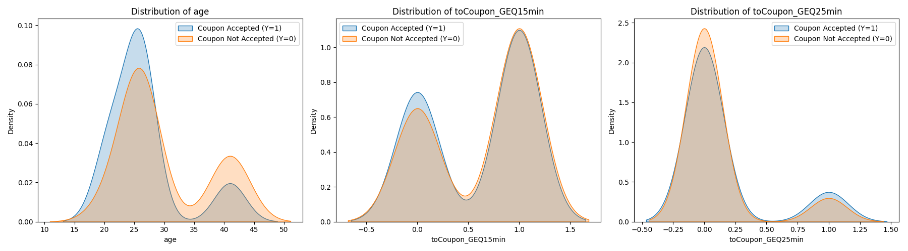
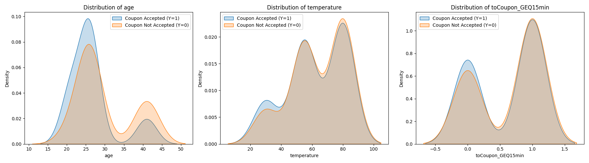

# AI-ML
# Coupon Acceptance Analysis

This repository explores which features are most strongly correlated with **coupon acceptance** (Y=1) versus **not accepting** a coupon (Y=0). Below, you’ll find:

- A summary of the dataset and cleaning steps  
- Correlation analysis results  
- Visualizations showing how key features differ between those who accept coupons and those who don’t  

---

## Table of Contents

1. [Overview](#overview)  
2. [Data Cleaning & Preparation](#data-cleaning--preparation)  
3. [Correlation Analysis](#correlation-analysis)  
4. [Key Observations](#key-observations)  
   - [Top Features for Coupon Acceptance](#top-features-for-coupon-acceptance)  
   - [Top Features for Not Accepting a Coupon](#top-features-for-not-accepting-a-coupon)  
5. [Visualizations](#visualizations)  
6. [How to Run](#how-to-run)  
7. [Contributing](#contributing)  
8. [License](#license)  

---

## Overview

The goal of this project is to figure out which features in our dataset best predict whether a customer will accept a coupon (`Y=1`) or not (`Y=0`). We use:

- **Correlation Analysis**: To pinpoint which numeric columns have the strongest linear relationship with `Y`.  
- **KDE Plots**: To visualize how each feature’s distribution differs between coupon-accepting and coupon-rejecting groups.  

---

## Data Cleaning & Preparation

1. **Load Data**: We import the CSV (`coupons.csv`).  
2. **Drop NaNs**: Rows missing any of our key columns (e.g., `age`, `car`, `coupon`, etc.) are removed.  
3. **Remove Duplicates**: Ensures we’re only working with unique rows.  
4. **Type Conversion**: Key numeric columns are converted to proper numeric types.  
5. **Split Data**: We separate the dataset into two groups:
   - `cpnYes`: Customers who accepted the coupon (`Y=1`)  
   - `cpnNo`: Customers who did not accept the coupon (`Y=0`)  
6. **Outlier Capping**: Within each group, we clip values at the 1st and 99th percentiles to mitigate outliers.

---

## Correlation Analysis

We compute the correlation matrix for our numeric columns, focusing on how each feature correlates with `Y` (coupon acceptance).

- **Positive correlation**: Higher values of the feature are more common in the coupon-accepting group.  
- **Negative correlation**: Higher values of the feature are more common in the coupon-rejecting group.  

---

## Key Observations

### Top Features for **Coupon Acceptance** (Y=1)

1. **Age**  
   - The highest positive correlation with `Y`.  
   - In our KDE plot, the accepted group skews slightly older, suggesting age is a good predictor for coupon acceptance.

2. **toCoupon_GEQ15min**  
   - The second strongest positive correlation.  
   - Indicates that a certain threshold (≥15 min) for coupon usage might correlate with a higher acceptance rate.

3. **toCoupon_GEQ25min**  
   - The third strongest positive correlation.  
   - While not as influential as `age` or `toCoupon_GEQ15min`, it still matters for acceptance.

### Top Features for **Not Accepting** a Coupon (Y=0)

When we sort by ascending correlation, we see the features most associated with **coupon rejection** (negative correlation with Y):

1. **Age**  
   - Interestingly, `age` appears here too, which suggests a more **complex or non-linear** pattern.  
   - Some age groups may be more likely to accept, while others are not.

2. **Temperature**  
   - Different temperature ranges might discourage coupon usage, showing up as a negative correlation.

3. **toCoupon_GEQ5min**  
   - Its distribution suggests that shorter thresholds or certain range values of this feature align more with not accepting the coupon.

---

## Visualizations

1. **KDE Plots for Top 3 Features (Accepting)**  
     
   Each plot compares how a feature’s values are distributed for `Y=1` (accepted) versus `Y=0` (rejected).

2. **KDE Plots for Top 3 Features (Not Accepting)**  
     
   Shows which features are most strongly linked with rejecting the coupon.

From these plots, you can visually confirm which features skew more toward the accepting group and which skew more toward the rejecting group.

---

## How to Run

1. **Clone or Download** this repository.  
2. **Install Dependencies**:
   ```bash
   pip install -r requirements.txt
